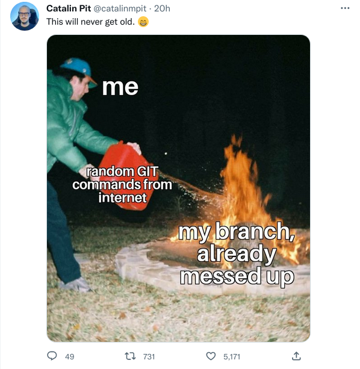
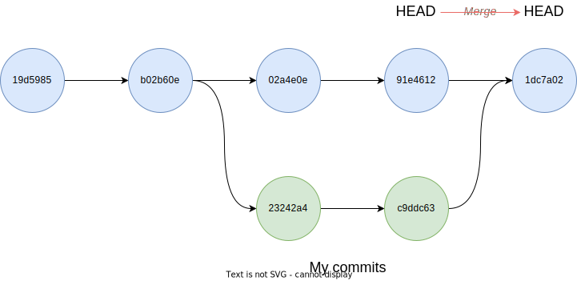
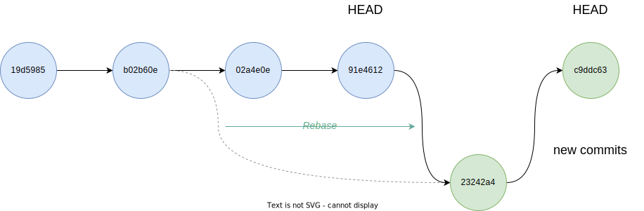

# Conflicts

<div class="questions">

### Questions

- What do I do when my changes conflict with someone else's?

</div>

<div class="objectives">

### Objectives

- Explain what conflicts are and when they can occur
- Explain how git behaves when it can't merge your changes
- Resolve conflicts from a merge

</div>  


We've shown an example of the sorts of changes which Git can merge
automatically - where the changes are in separate parts of the file. But, as
soon as people can work in parallel, they'll likely step on each other's toes.



This will even happen with a single person: if we are working on a piece of
software on both our laptop and a server in the lab, we could make different
changes to each copy.  Version control helps us manage these conflicts by
giving us tools to resolve overlapping changes.

To see how we can resolve conflicts, we must first create one.

The file `mean.py` should currently look like this on the `main` branch of both partners' copies of our `mean` repository:

```sh
cat mean.py
```

```python
import pandas as pd
dataframe = pd.read_csv("rgb.csv")


blues = dataframe["blue"]
print(blue.means())
```

Let's let Alice make a change to her file: she decides that she wants to
set the column for the mean calculation in a constant at the top of her script:

```sh
nano mean.py
cat mean.py
```

```python
import pandas as pd
COLUMN = "blue"
dataframe = pd.read_csv("rgb.csv")


subset = dataframe[COLUMN]
print(subset.means())
```

and then push the change to GitHub:

```sh
git add mean.py
git commit -m "Make the subset column a constant"
```

```abc
[main cde8d2e] Make the subset column a constant
 1 file changed, 3 insertions(+), 2 deletions(-)
```

```sh
git push origin main
```

```abc
Enumerating objects: 17, done.
Counting objects: 100% (17/17), done.
Delta compression using up to 12 threads
Compressing objects: 100% (15/15), done.
Writing objects: 100% (15/15), 1.44 KiB | 1.44 MiB/s, done.
Total 15 (delta 8), reused 0 (delta 0), pack-reused 0
remote: Resolving deltas: 100% (8/8), completed with 1 local object.
To github.com:alice/mean.git
   dea7c3c..cde8d2e  main -> main
```

Now let's have Bob make a change to their copy *without* updating from GitHub:

```sh
nano mean.py
cat mean.py
```

We'll make a change which overlaps with Alice's changes - Bob's had the same
idea, but has given his constant a different name, and has changed its value
back to "red":

```python
import pandas as pd
COLOUR="red"
dataframe = pd.read_csv("rgb.csv")


coloured = dataframe[COLOUR]
print(coloured.means())
```

We can commit the change locally:

```sh
git add mean.py
git commit -m "Parametrised the column to subset"
```

```abc
[main 7720ff0] Parametrised the column to subset
 1 file changed, 5 insertions(+), 1 deletion(-)
```

When Bob tries to push his changes to GitHub, Git complains and refuses:

```sh
git push origin main
```

```abc
To github.com:alice/mean.git
 ! [rejected]        main -> main (fetch first)
error: failed to push some refs to 'github.com:spikelynch/mean.git'
hint: Updates were rejected because the remote contains work that you do
hint: not have locally. This is usually caused by another repository pushing
hint: to the same ref. You may want to first integrate the remote changes
hint: (e.g., 'git pull ...') before pushing again.
hint: See the 'Note about fast-forwards' in 'git push --help' for details.
```


Git rejects the push because it detects that the remote repository has new
updates that have not been incorporated into the local branch. What we have to
do is pull the changes from GitHub.

Now we come to some exciting, or exasperating, developments: Git is an actively
developed piece of open-source software. Over the last couple of years, there
have been some changes to the way Git handles the situation we're about to
trigger, and depending on when you installed Git, we might get some different
sorts of behaviour at the command line.

I'll have to go into a little bit of detail to explain what's happening, even
though the net result will be the same.

What we're going to use is the `git pull` command. This asks Git to do two things:
fetch the HEAD of the branch we're interested in from a remote repository, 
giving us a local copy of the latest version from the remote. We then want
Git to `merge` that set of changes into our current branch.

We've set up a situation, however, where Bob and Alice's version of the file
are inconsistent, in a way which `merge` is unable to resolve.

Let's see what happens, and I'll see what messages we're getting, and step
through the explanations.

```sh
git pull origin main
```

If Bob has a recent version of Git (2.33 or newer), pulling from Alice's remote
should result in a long message like the following, ending in a fatal error:

```abc
remote: Enumerating objects: 20, done.
remote: Counting objects: 100% (20/20), done.
remote: Compressing objects: 100% (9/9), done.
remote: Total 18 (delta 8), reused 18 (delta 8), pack-reused 0
Unpacking objects: 100% (18/18), 1.62 KiB | 110.00 KiB/s, done.
From github.com:alice/mean
 * branch            main       -> FETCH_HEAD
   2408b26..cde8d2e  main       -> origin/main
hint: You have divergent branches and need to specify how to reconcile them.
hint: You can do so by running one of the following commands sometime before
hint: your next pull:
hint:
hint:   git config pull.rebase false  # merge
hint:   git config pull.rebase true   # rebase
hint:   git config pull.ff only       # fast-forward only
hint:
hint: You can replace "git config" with "git config --global" to set a default
hint: preference for all repositories. You can also pass --rebase, --no-rebase,
hint: or --ff-only on the command line to override the configured default per
hint: invocation.
fatal: Need to specify how to reconcile divergent branches.
```

Can everyone who's got the fatal error raise their hand and we'll see how 
we're doing? Thanks.

What's happened here is that Git is refusing to try to reconcile the two
branches, without being told what to do by default.

To get our heads around this, we can go back to the directed acyclic graphs.

So far, we've looked at reconciling two branches by merging them. You can think
of this as Git's attempt to make a version which contains all of the commits
from both branches.



The other way to reconcile two divergent branches is a separate tool, `git rebase`. 
[Rebasing](https://www.atlassian.com/git/tutorials/rewriting-history/git-rebase) tells Git that I want to fetch the latest version of this branch from
the remote, then take all of my local commits - all of the changes I've 
made since our branches diverged - and apply them to the latest HEAD of the 
branch. In a sense, it's like rewriting history - we fast-forward the repository
to get everyone else's work, and then apply our own.



Rebasing can be complicated and counterintuitive, which is why we don't have
time to cover it in more detail here - it's become common practice in large
teams because it can effectively give the trunk of a repo a linear history,
but it's not really recommended for beginners.

The reason for the change in the behaviour of `git pull` is that increasingly, 
rebasing is becoming more popular as a way of incorporating the latest updates
from the team into your work. For small teams or solo developers, however,
merging is fine.

We want to tell Git to *not* rebase, but to try to merge.

If you're one of the people who got the fatal error, try running `git pull`
again, with the --no-rebase command line flag:

```sh
git pull --no-rebase origin main
```

```abc
From github.com:alice/mean
 * branch            main       -> FETCH_HEAD
Auto-merging mean.py
CONFLICT (content): Merge conflict in mean.py
Automatic merge failed; fix conflicts and then commit the result.
```

Now, if there are any people who didn't get the fatal error the first time,
let's see if this looks familiar:

```abc
remote: Enumerating objects: 5, done.
remote: Counting objects: 100% (5/5), done.
remote: Compressing objects: 100% (1/1), done.
remote: Total 3 (delta 2), reused 3 (delta 2), pack-reused 0
Unpacking objects: 100% (3/3), done.
From https://github.com/alice/mean
 * branch            main     -> FETCH_HEAD
    29aba7c..dabb4c8  main     -> origin/main
Auto-merging mean.py
CONFLICT (content): Merge conflict in mean.py
Automatic merge failed; fix conflicts and then commit the result.
```

This is how `git pull` behaved before version 2.27, when it used to merge by
default and not warn you about it. If this happened to you, git has fetched
Alice's copy and tried, and failed, to merge it with the local changes.

The third possibility is for people with a copy of Git with a version between
2.27 and 2.33: this gives the long set of warnings about needing to specify a
reconciliation strategy, but defaults to `merge` anyway, and should look
something like this:

```abc
remote: Enumerating objects: 20, done.
remote: Counting objects: 100% (20/20), done.
remote: Compressing objects: 100% (9/9), done.
remote: Total 18 (delta 8), reused 18 (delta 8), pack-reused 0
Unpacking objects: 100% (18/18), 1.62 KiB | 110.00 KiB/s, done.
From github.com:alice/mean
 * branch            main       -> FETCH_HEAD
   2408b26..cde8d2e  main       -> origin/main
hint: You have divergent branches and need to specify how to reconcile them.
hint: You can do so by running one of the following commands sometime before
hint: your next pull:
hint:
hint:   git config pull.rebase false  # merge (the default strategy)
hint:   git config pull.rebase true   # rebase
hint:   git config pull.ff only       # fast-forward only
hint:
hint: You can replace "git config" with "git config --global" to set a default
hint: preference for all repositories. You can also pass --rebase, --no-rebase,
hint: or --ff-only on the command line to override the configured default per
hint: invocation.
Auto-merging mean.py
CONFLICT (content): Merge conflict in mean.py
Automatic merge failed; fix conflicts and then commit the result.
```

You can check which version of Git you have installed by running this command:

```sh
git --version
```

```abc
git version 2.37.0 (Apple Git-136)
```

Let's just go around the room and check that everyone has a big CAPS-LOCK
message saying CONFLICT (usually you don't look for conflict in this kind
of workshop, but it's git.)

So now that we're all on the same page:

1. Git has tried to merge changes from the remote branch.
2. Git has detected that changes made to the local copy overlap with those made to the remote repository.
3. Therefore, git refuses to merge the two versions to stop us from trampling on our previous work. 

The conflict is marked in in the affected file:

```sh
cat mean.py
```

```abc
import pandas as pd
<<<<<<< HEAD
COLOUR="red"
dataframe = pd.read_csv("rgb.csv")


coloured = dataframe[COLOUR]
print(coloured.means())
=======
COLUMN = "blue"
dataframe = pd.read_csv("rgb.csv")


subset = dataframe[COLUMN]
print(subset.means())
>>>>>>> cde8d2ea9799a6ccbcfafabd311913cd3f70df17
```subset.means())
```

Our change is preceded by `<<<<<<< HEAD`.
Git has then inserted `=======` as a separator between the conflicting changes
and marked the end of the content downloaded from GitHub with `>>>>>>>`.
(The string of letters and digits after that marker
identifies the commit we've just downloaded.)

It is now up to us to edit this file to remove these markers
and reconcile the changes.
We can do anything we want: 
- Keep the change made in the local repository
- Keep the change made in the remote repository
- Write something new to replace both
- Get rid of the change entirely.

Let's replace both so that the file looks like this - we'll keep Alice's 
constant name `COLUMN` but change the default value back to red.

```sh
cat mean.py
```

```python
import pandas as pd
COLUMN="red"
dataframe = pd.read_csv("rgb.csv")

subset = dataframe[COLUMN]
print(subset.means())
```

To finish merging, we let git know that we've resolved the conflict by using
`git add`.

This always feels like an anticlimax to me - when I've resolved a 
conflict I feel like I should be able to say `git resolve` or `git peace-out`
or something - but from git's point of view, this resolution is just another 
set of changes to add to the staging area:

```sh
git add mean.py
git status
```


```abc
On branch main
All conflicts fixed but you are still merging.
  (use "git commit" to conclude merge)

Changes to be committed:

	modified:   mean.py

```

```sh
git commit -m "Merge changes from GitHub"
```

```abc
[main 2abf2b1] Merge changes from GitHub
```

Now Bob can push his changes to GitHub:

```sh
git push origin main
```

```abc
Enumerating objects: 10, done.
Counting objects: 100% (10/10), done.
Delta compression using up to 12 threads
Compressing objects: 100% (6/6), done.
Writing objects: 100% (6/6), 709 bytes | 709.00 KiB/s, done.
Total 6 (delta 2), reused 0 (delta 0), pack-reused 0
remote: Resolving deltas: 100% (2/2), completed with 2 local objects.
To github.com:alice/mean.git
   cde8d2e..19cb059  main -> main
```

Git keeps track of what we've merged with what,
so we don't have to fix things by hand again
when Alice pulls again:

```sh
git pull origin main
```

```abc
remote: Enumerating objects: 10, done.
remote: Counting objects: 100% (10/10), done.
remote: Compressing objects: 100% (4/4), done.
remote: Total 6 (delta 2), reused 6 (delta 2), pack-reused 0
Unpacking objects: 100% (6/6), 689 bytes | 137.00 KiB/s, done.
From github.com:spikelynch/mean
 * branch            main       -> FETCH_HEAD
   cde8d2e..19cb059  main       -> origin/main
Updating cde8d2e..19cb059
Fast-forward
 mean.py | 4 ++--
 1 file changed, 2 insertions(+), 2 deletions(-)
```

We get the merged file:

```sh
cat mean.py
```

```python
import pandas as pd
COLUMN="red"
dataframe = pd.read_csv("rgb.csv")

subset = dataframe[COLUMN]
print(subset.means())
```

We don't need to merge again because Git knows someone has already done that.

:::{.callout-important}
### Conflict resolution in teams

Git's ability to resolve conflicts is very useful, but conflict resolution
costs time and effort, and can introduce errors if conflicts are not resolved
correctly. If you find yourself resolving a lot of conflicts in a project,
consider these technical approaches to reducing them:

- Pull from upstream more frequently, especially before starting new work.
- Use topic branches to segregate work, merging to main when complete.
- Make smaller more atomic commits.
- Where logically appropriate, break large files into smaller ones so that it is
  less likely that two authors will alter the same file simultaneously.

Conflicts can also be minimized with project management strategies:

- Clarify who is responsible for what areas with your collaborators.
- Discuss what order tasks should be carried out in with your collaborators so
  that tasks expected to change the same lines won't be worked on simultaneously.
- If the conflicts are stylistic churn (e.g. tabs vs. spaces), establish a
  project convention that is governing and use code style tools (e.g.
  `htmltidy`, `perltidy`, `rubocop`, etc.) to enforce, if necessary.
:::

<div class="keypoints">

### Key Points

- Conflicts occur when two or more people change the same lines of the same file.
- Git can emit a lot of warning messages when this happens
- There have been recent changes to how Git behaves when you pull updates from a remote
- The version control system does not allow people to overwrite each other's changes blindly, but highlights conflicts so that they can be resolved.
</div>
