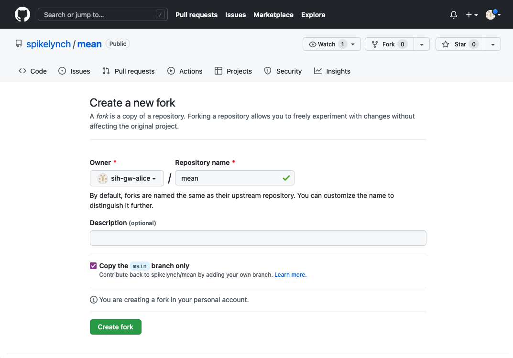
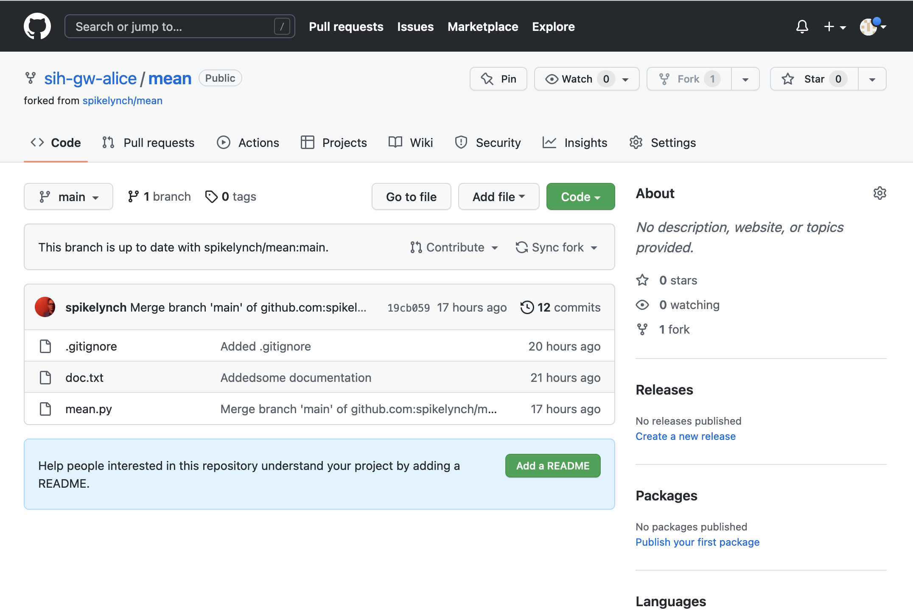
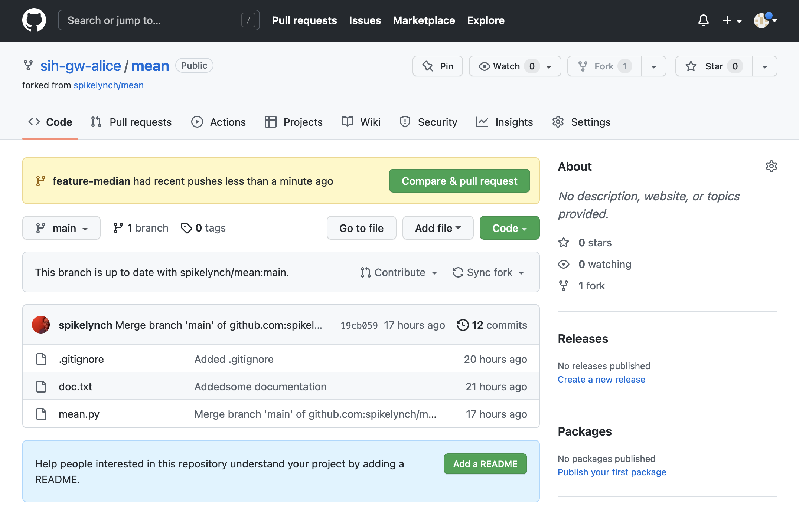
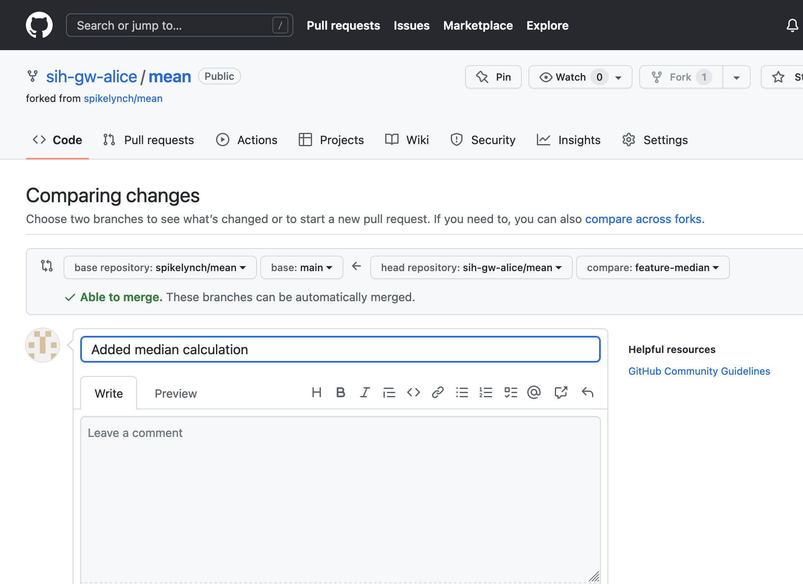
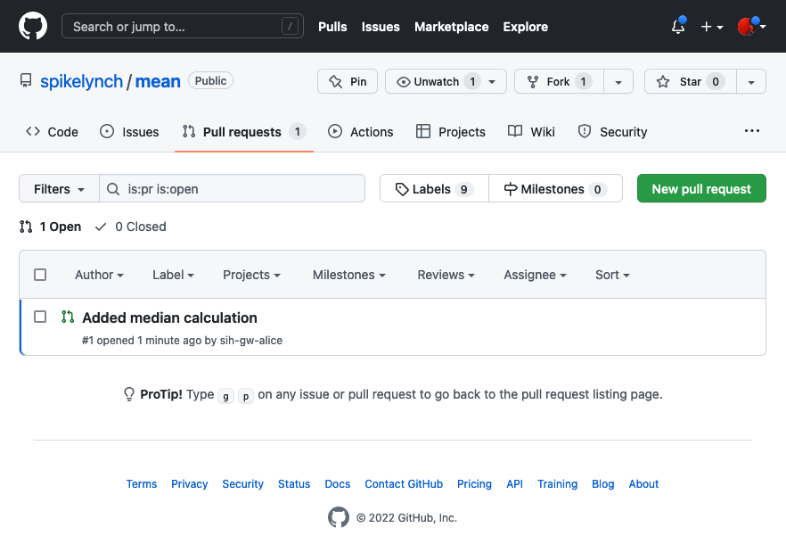
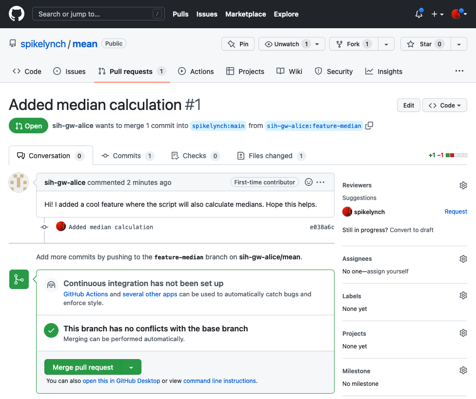
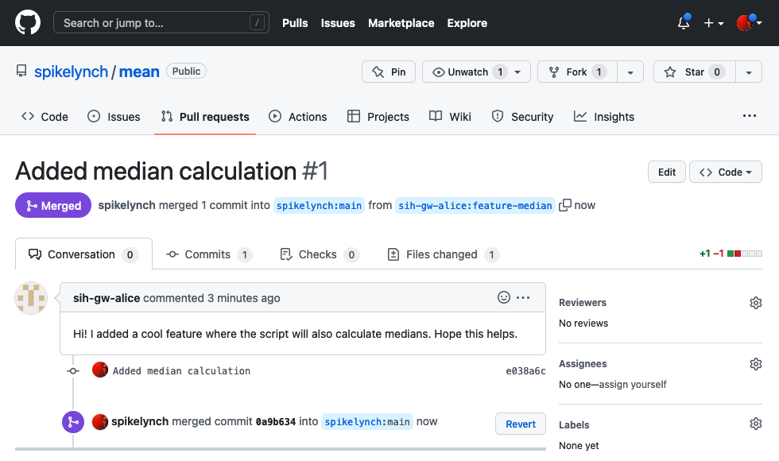

# Pull requests

<div class="questions">

### Questions

- How can I contribute to someone else's project with a pull request?

</div>

<div class="objectives">

### Objectives

- Understand how to fork someone else's codebase
- Understand how to contribute your changes back to theirs with a pull request

</div>  


<div class="keypoints">

### Key Points

- Forking allows you to create your own copy of an existing open-source project
- Pull requests are a way to offer your changes back to a project

</div>

We've just seen a branching workflow for allowing collaboration between a team
of developers, each of whom has a local repo and who share a repo on GitHub.

In this section, we'll step through what's called a fork-based workflow, which
is a way to contribute code to another team's project.

A fork-based workflow has the following steps:

1. You fork the projects repo on GitHub - this is similar to cloning, but you're
creating a clone of the repo in your own GitHub account, not on your local machine.

2. You create a local copy of your fork of the project

3. You create a branch on your repo where you'll work on the changes that you
want to contribute

4. You push your changes to your remote copy of the project's repo

5. On GitHub, you create a pull request for the maintainer of the original
project

It's called a pull request because you're asking the maintainer to pull your
contribution into their version of the project.

After you've made the pull request, the maintainer can accept it straight away,
or start a form of collaboration to talk about the changes - this can take the 
form of a code review. We won't have time to cover that in this workshop, but
it's a very common form of quality control for open source projects, and is
also used within teams.

### Outline of this section

*Note: check whether Bob will already have write access to Alice's repo?*

1. Bob creates a fork it






2. Bob starts a branch called `feature-median`


```sh
git checkout -b feature-median
```

```abc
Switched to a new branch 'feature-median'
```

3. Bob makes a change to mean.py 

```sh
nano mean.py
cat mean.py
```

```abc
import pandas as pd
COLUMN="red"
dataframe = pd.read_csv("rgb.csv")

subset = dataframe[COLUMN]
print(subset.mean())
print(subset.median())
```

```sh
git add mean.py
git commit mean.py -m "Added median calculation"
```

```abc
[feature-median] f1ea0c1] Added median calculation
 1 file changed, 2 insertions(+), 2 deletions(-)
```


5. Bob pushes his change to GitHub

```sh
git push
```

```abc
fatal: The current branch feature-median has no upstream branch.
To push the current branch and set the remote as upstream, use

    git push --set-upstream origin feature-median

To have this happen automatically for branches without a tracking
upstream, see 'push.autoSetupRemote' in 'git help config'.
```

```sh
git push --set-upstream origin feature-median
```

```abc
Enumerating objects: 5, done.
Counting objects: 100% (5/5), done.
Delta compression using up to 12 threads
Compressing objects: 100% (3/3), done.
Writing objects: 100% (3/3), 311 bytes | 311.00 KiB/s, done.
Total 3 (delta 2), reused 0 (delta 0), pack-reused 0
remote: Resolving deltas: 100% (2/2), completed with 2 local objects.
remote:
remote: Create a pull request for 'feature-median' on GitHub by visiting:
remote:      https://github.com/sih-gw-alice/mean/pull/new/feature-median
remote:
To github.com:sih-gw-alice/mean.git
 * [new branch]      feature-median -> feature-median
branch 'feature-median' set up to track 'origin/feature-median'.
```

6. Bob can now see his new branch on GitHub



8. Bob creates a pull request based on his `feature-median` branch 



9. Alice confirms to see if the pull request is there





10. Alice can now merge Bob's feature branch into the main of her version



This was an example of a simple pull request, where Git was able to 
automatically merge the new code with the existing main branch - using the
same algorithm as when we merged a branch locally.

It's also possible for the changes on a pull request to conflict with the main
branch - the two could have divergent history. In this case, GitHub will 
indicate this to the maintainer, and provides an interface for showing each 
of the conflicts, and also for resolving them via the web interface.

There are other ways to handle this situation - the maintainer could ask the
contributor to pull the latest updates from main and resolve the conflicts at
their end. How this is handled will depend a lot on the particular project
being contributed to.

Large open-source projects tend to have a lot of structure around pull requests:
they will, for instance, provide a checklist of things contributors should do
when contributing code: require that PRs be raised against an existing issue,
provide a template for issues and/or PR comments, and so on.

